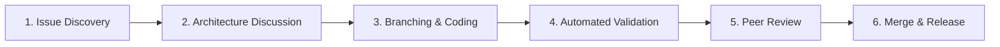

# Contributing to N.O.V.A.

Thank you for your interest in contributing. This document describes how to set up
the development environment, submit changes, and follow the project's engineering standards.

> **Note**: N.O.V.A. is a prototype research project built for educational and portfolio
> purposes. Please read the [SECURITY.md](SECURITY.md) before working with the authentication
> subsystem.

---

## Development Environment

### Required Software

| Software | Version | Purpose |
|:---|:---|:---|
| Arduino IDE | 2.x or later | Firmware compilation |
| Arduino ESP32 Board Package | 2.x or later | ESP32-S3 and ESP32 targets |
| Adafruit PN532 Library | Latest | NFC reader driver |
| Edge Impulse Arduino Library | See library.properties | TinyML inference engine |

### Board Configuration

**Subsystem 1 (ESP32-S3)**:
- Board: `ESP32S3 Dev Module`
- Upload Speed: `921600`
- USB Mode: `Hardware CDC and JTAG`
- Partition Scheme: `Default 4MB with spiffs`

**Subsystem 2 (ESP32)**:
- Board: `ESP32 Dev Module`
- Upload Speed: `921600`
- Partition Scheme: `Default`

---

## Repository Structure

```
subsystem1_secure_access/   ← Flash to ESP32-S3
subsystem2_docking/         ← Flash to ESP32
docs/                       ← Technical documentation
hardware/                   ← Schematics, BOM, datasheets
validation/                 ← Test plans and results
```

---

## Coding Standards

All contributions must comply with the [Implementation Specification](docs/).
Key rules:
- All configurable constants in `config.h` — no magic numbers elsewhere
- No `delay()` in HAL or DSP modules
- No dynamic memory allocation (`new`, `malloc`)
- Maximum function length: 40 lines
- All public functions documented with Doxygen

---

## Engineering Workflow Pipeline (AUD-029)

Contributions follow a structured 6-stage engineering pipeline to preserve architecture consistency, memory safety, and signal processing rigor:



### Stage Details
1. **Issue Discovery & Logging:** Open a GitHub Issue describing the bug, feature request, or optimization. Check [`docs/KNOWN_LIMITATIONS.md`](docs/KNOWN_LIMITATIONS.md) before filing.
2. **Architecture Discussion:** Align on implementation design. Verify if proposed changes affect single sources of truth in `config.h` or break physical noise boundaries.
3. **Branching & Coding Standards:** Create a feature branch (`feat/description` or `fix/issue-number`). Comply with zero dynamic memory allocation (`malloc`/`new`), 40-line function bounds, and strict Doxygen header documentation (`@author`, `@file`, `@brief`).
4. **Automated Validation:** Execute mathematical verification scripts (`python validation/test_harnesses/test_goertzel.py`, `test_auth_fsm.py`) and compile firmware using `arduino-cli`.
5. **Peer Review & Verification:** Complete all items in `.github/PULL_REQUEST_TEMPLATE.md` and attach test execution logs.
6. **Merge & Release:** Approved changes are merged into main development branches and logged in [`CHANGELOG.md`](CHANGELOG.md).

---

## Pull Request Process

1. Fork the repository
2. Create a feature branch: `feat/your-description` or `fix/issue-number`
3. Implement your change following the coding standards above
4. Run all applicable validation tests and document results in `validation/results/`
5. Complete the PR checklist in `.github/PULL_REQUEST_TEMPLATE.md`
6. Open a Pull Request against the `develop` branch

---

## Issue Reporting

Use the issue templates in `.github/ISSUE_TEMPLATE/`:
- **Bug Report** — for firmware or hardware issues
- **Feature Request** — for proposed improvements
- **Hardware Question** — for wiring or component questions

---

## License

By contributing, you agree that your contributions are licensed under the
project's MIT License. See [LICENSE](LICENSE) for details.
