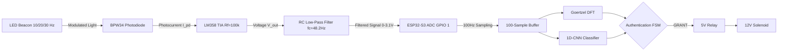

# N.O.V.A. — Navigational Optical Verification & Authentication

[](https://github.com/kik1211/nova-vlc-secure-docking/actions/workflows/compile_check.yml)
[](LICENSE)
[](docs/HARDWARE.md)
[](CHANGELOG.md)

> An engineering research prototype demonstrating physical access security and autonomous optical docking using Visible Light Communication (VLC), Near Field Communication (NFC), and TinyML.  
> **Awarded First Prize at College Project Expo.**

### Key Engineering Benchmarks & Design Specifications
| Performance Metric | Design Target / Verification Status | Significance & Engineering Impact |
|:---|:---:|:---|
| **ADC Sampling Target** | $100.0\text{ Hz}$ Target ($T_s = 10.000\text{ ms}$) | Hardware timer `esp_timer` ISR minimizes software sampling jitter |
| **Goertzel DSP Latency** | Estimated $< 0.8\text{ ms}$ ($k=10, 20, 30$) | Algorithmic $O(NK)$ complexity for low-latency spectral verification |
| **TinyML 1D-CNN Latency** | Estimated $< 15.0\text{ ms}$ (Xtensa LX7 SIMD) | Vector accelerated neural network inference budget |
| **Model Size & Memory Footprint** | $534\text{ parameters}$ ($2.1\text{ KB}$ weights, $448\text{ B}$ arena) | Extremely lightweight RAM footprint suitable for microcontrollers |
| **Angular Scanning Resolution** | $0.08789^\circ / \text{step}$ ($4096\text{ half-steps/rev}$) | Theoretical angular step resolution of 1:64 geared unipolar stepper |
| **Security False Accept Rate (FAR)** | 0 False Unlocks in Harness Suite | Dual-Verdict Gate ($L_{\text{NFC}} \land \text{Conf}_{\text{ML}} \land M_{\text{Goertzel}}$) prevents unverified unlocks in test harness |

---

## 1. Project Story & Engineering Motivation

Physical access control systems rely heavily on Radio Frequency (RF) technologies like RFID, Bluetooth, or Wi-Fi. However, RF signals penetrate walls, are vulnerable to distant eavesdropping, RF relay attacks, and signal jamming. **N.O.V.A.** (Navigational Optical Verification & Authentication) was created to demonstrate a physically secure, localized alternative by pairing **Near Field Communication (NFC)** with directional **Visible Light Communication (VLC)**.

Key engineering milestones of the project include:
1. **Addressing RF Vulnerabilities:** Modulated optical signals require line-of-sight propagation, confining access credentials within physical boundaries and eliminating RF eavesdropping.
2. **Dual-Verdict Access Security:** To prevent ambient light flicker or artificial light interference from causing false unlocks, a dual-verdict verification pipeline was developed. An **Edge Impulse 1D-CNN TinyML model** works in parallel with a deterministic **Goertzel DFT algorithm**—access is granted only when both algorithms independently confirm the optical key frequency matches the NFC cardholder's role.
3. **Autonomous Docking Solution:** To eliminate manual alignment errors in autonomous environments (e.g., robotic docking stations or optical transceivers), Subsystem 2 provides autonomous angular optical alignment driven by a 28BYJ-48 stepper motor.
4. **Recognition:** Awarded **First Prize at the College Project Expo** for embedded system innovation, signal processing rigor, and TinyML integration.

---

## 2. Visual Overview & Signal Flow

### 2.1 Overall System Architecture
The current prototype comprises two independent standalone hardware subsystems designed with complete noise isolation:

```mermaid
graph TD
    subgraph SS1 ["Subsystem 1: Secure Access Control (ESP32-S3)"]
        A[MIFARE NFC Card] -->|13.56 MHz RFID| B[PN532 Reader I2C]
        B -->|Resolved Role| C[Auth State Machine FSM]
        D[Modulated Optical LED] -->|Free-Space Light| E[BPW34 PIN Photodiode]
        E -->|Photocurrent I_pd| F[LM358 Op-Amp TIA Gain=100k]
        F -->|Analog Voltage V_out| G[RC Filter fc=48.2 Hz]
        G -->|GPIO 1 ADC1_CH0| H[100 Hz esp_timer ISR]
        H -->|100 Float Samples| I[Dual-Verdict Gate]
        I -->|Pipeline 1: 1D-CNN| J[Edge Impulse Classifier]
        I -->|Pipeline 2: Goertzel DFT| K[Goertzel k=10,20,30]
        J -->|ML Verdict >= 85%| L{Dual-Verdict 2FA Gate}
        K -->|DSP Dominance Ratio >= 2.0| L
        C --> L
        L -->|BOTH VERDICTS PASS| M[5V Relay Module]
        M -->|12V DC Pulse| N[Fail-Secure Solenoid Lock]
    end

    subgraph SS2 ["Subsystem 2: Autonomous Optical Docking (ESP32)"]
        O[Beacon Light LED] -->|Photocurrent| P[Docking BPW34 Sensor]
        P -->|ADC Read GPIO 34| Q[Alignment Controller]
        Q -->|8-Phase Half-Step| R[ULN2003 Driver + 28BYJ-48 Stepper]
        R -->|Rotate Platform 360 deg| P
    end
```



### 2.2 Analog Front-End Signal Flow


---

## 3. Hardware Bill of Materials (BOM) & Pinout Table

### Primary Pinout Mapping
| Subsystem | Microcontroller | Component | GPIO Pin | Function | Logic Level |
|:---|:---|:---|:---:|:---|:---|
| **Subsystem 1** | ESP32-S3 DevKit-C | BPW34 + LM358 TIA | **GPIO 1** | ADC1_CH0 Optical Signal Input | $0\text{--}3.1\text{ V}$ Analog |
| **Subsystem 1** | ESP32-S3 DevKit-C | 5V Relay Module | **GPIO 4** | Solenoid Unlock Assert | $3.3\text{ V}$ Active HIGH |
| **Subsystem 1** | ESP32-S3 DevKit-C | PN532 NFC Module | **GPIO 8 / 9** | I2C SDA / SCL | $3.3\text{ V}$ I2C Open-Drain |
| **Subsystem 2** | ESP32 DevKit-V1 | ULN2003 IN1--IN4 | **GPIO 13, 12, 14, 27** | Stepper Motor Coils A, B, C, D | $3.3\text{ V}$ Digital |
| **Subsystem 2** | ESP32 DevKit-V1 | BPW34 Photodiode | **GPIO 34** | Docking Sensor ADC Input | $0\text{--}3.3\text{ V}$ Analog |

---

## 4. Building & Flashing Instructions

### Prerequisites
* Arduino IDE 2.x or `arduino-cli`
* ESP32 Board Package (`esp32` by Espressif Systems v2.0.11+)
* Adafruit PN532 Library (`arduino-cli lib install "Adafruit PN532"`)

### Compiling via Arduino CLI
```bash
# 1. Compile Subsystem 1 (ESP32-S3)
arduino-cli compile --fqbn esp32:esp32:esp32s3 subsystem1_secure_access/subsystem1_secure_access.ino

# 2. Compile Subsystem 2 (ESP32)
arduino-cli compile --fqbn esp32:esp32:esp32 subsystem2_docking/subsystem2_docking.ino
```

### Running Verification Suite
```bash
# Run host DSP & FSM mathematical verification suite
python validation/test_harnesses/test_goertzel.py
python validation/test_harnesses/test_auth_fsm.py
```

---

## 5. Documentation Reference Index

| Document | Purpose & Key Topics | Cross-References |
|:---|:---|:---|
| [`docs/ARCHITECTURE.md`](docs/ARCHITECTURE.md) | Complete system architecture, subsystem boundaries, formal interface specifications, signal chain diagrams, and inter-subsystem independence status | See [`docs/HARDWARE.md`](docs/HARDWARE.md), [`docs/SIGNAL_PROCESSING.md`](docs/SIGNAL_PROCESSING.md) |
| [`docs/HARDWARE.md`](docs/HARDWARE.md) | Component selection rationale (AUD-019), datasheet electrical operating limits (AUD-023), BOM, schematics, pinout tables, and assembly guidelines | See [`hardware/bom/`](hardware/bom/), [`docs/ARCHITECTURE.md`](docs/ARCHITECTURE.md) |
| [`docs/SIGNAL_PROCESSING.md`](docs/SIGNAL_PROCESSING.md) | 100 Hz sampling theory, Goertzel mathematical derivation, zero spectral leakage proofs, and full signal chain diagrams | See [`validation/test_harnesses/test_goertzel.py`](validation/test_harnesses/test_goertzel.py) |
| [`docs/TINYML.md`](docs/TINYML.md) | 1D-CNN network architecture, 534-parameter model footprint, tensor arena allocation, and Edge Impulse integration | See [`NOVA_Secure_Lock_inferencing/`](NOVA_Secure_Lock_inferencing/) |
| [`docs/DOCKING.md`](docs/DOCKING.md) | Two-phase coarse/fine alignment algorithm, 28BYJ-48 motor kinematics, and backlash compensation math | See [`subsystem2_docking/`](subsystem2_docking/) |
| [`docs/SECURITY_MODEL.md`](docs/SECURITY_MODEL.md) | Threat model, attack vector countermeasures, dual-verdict veto logic, and authentication state machine | See [`subsystem1_secure_access/auth/`](subsystem1_secure_access/auth/) |
| [`docs/KNOWN_LIMITATIONS.md`](docs/KNOWN_LIMITATIONS.md) | Engineering trade-offs, optical link budget range constraints, LM358 output swing bounds, and gear backlash limits | See [`docs/HARDWARE.md`](docs/HARDWARE.md) |
| [`docs/VALIDATION_RESULTS.md`](docs/VALIDATION_RESULTS.md) | 30-test execution matrix with strict separation of verified simulation states vs physical bench tests | See [`validation/test_plan.md`](validation/test_plan.md) |
| [`knowledge-base/MASTER_GUIDE.md`](knowledge-base/MASTER_GUIDE.md) | Master entry point for interview preparation, engineering study roadmaps, and architecture decision records | See [`knowledge-base/DESIGN_DECISIONS.md`](knowledge-base/DESIGN_DECISIONS.md) |
| [`knowledge-base/DESIGN_DECISIONS.md`](knowledge-base/DESIGN_DECISIONS.md) | Architecture Decision Records (ADR-001 through ADR-008) capturing technical design choices | See [`docs/ARCHITECTURE.md`](docs/ARCHITECTURE.md) |

---

## 6. Repository Topics

This repository is indexed under the following GitHub topics for discoverability:

`embedded-systems` • `esp32` • `esp32-s3` • `visible-light-communication` • `vlc` • `tinyml` • `edge-impulse` • `goertzel` • `nfc` • `signal-processing` • `autonomous-docking` • `embedded-security` • `electronics` • `iot` • `cpp` • `arduino`

---

## 7. Frequently Asked Questions (FAQ)

#### Q1: Why combine the Goertzel DSP algorithm with a TinyML 1D-CNN classifier?
**Answer:** Neural network classifiers are probabilistic and can misclassify under unexpected lighting flicker or noise. The Goertzel algorithm provides a fast ($<1\text{ ms}$), deterministic mathematical check for target frequency magnitudes. Combining both in a **Dual-Verdict Gate** ensures access is granted ONLY when both algorithms independently confirm the optical key.

#### Q2: Why use Visible Light Communication (VLC) instead of RF (Wi-Fi, Bluetooth, RFID)?
**Answer:** RF signals penetrate walls and can be intercepted, jammed, or spoofed from a distance. Modulated light is physically bounded by line-of-sight propagation, creating a tight physical security zone where eavesdropping without direct optical line-of-sight is impossible.

#### Q3: Why was the BPW34 PIN photodiode chosen over phototransistors or integrated sensors?
**Answer:** The BPW34 offers a fast response time ($20\text{ ns}$ rise time) and a large radiant sensitive area ($7.5\text{ mm}^2$), providing linear photocurrent conversion across visible and near-IR wavelengths without the non-linear saturation associated with phototransistors.

#### Q4: Why was the LM358 operational amplifier selected for the Transimpedance Amplifier (TIA)?
**Answer:** The LM358 is low-cost and operates reliably from a single $+3.3\text{ V}$ supply rail matching the ESP32-S3 ADC reference level. Powering the LM358 from $+3.3\text{ V}$ naturally limits maximum output voltage to $\approx 1.8\text{ V}$, protecting the ESP32-S3 ADC pin from overvoltage damage without requiring external clamping Zeners.

#### Q5: Why use two microcontrollers (ESP32-S3 + ESP32 DevKit-V1) instead of a single MCU?
**Answer:** Motor drive switching transients ($>300\text{ mA}$ peak coil current) generate significant electromagnetic noise and ground bounce. Separating Subsystem 1 (Access Control) from Subsystem 2 (Docking Stepper Driver) maintains complete physical and electrical isolation for microsecond-accurate ADC sampling.

#### Q6: Do Subsystem 1 and Subsystem 2 communicate with each other over UART?
**Answer:** No. In the current N.O.V.A. prototype, Subsystem 1 and Subsystem 2 operate as **completely independent standalone hardware modules**. Inter-MCU serial communication (e.g., isolated UART or ESP-NOW) is designated as a Proposed Future Extension.

#### Q7: Why use dual-factor authentication (NFC + VLC)?
**Answer:** Single-factor NFC cards can be lost or stolen. Single-factor VLC keyfobs can be intercepted if pointed carelessly. Requiring both physical possession of a registered NFC card AND proximity to an optical key transmitter configured to the cardholder's role enforces true two-factor physical security ($L_{\text{NFC}} \land L_{\text{VLC}}$).

---

## 8. License
MIT License — see [LICENSE](LICENSE). Edge Impulse generated library files subject to separate terms.
