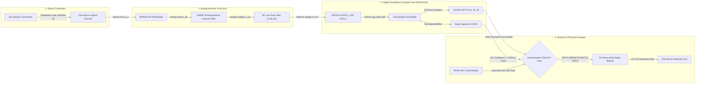

# N.O.V.A. System Architecture

> **Document Status:** Complete Architecture Specification v1.0  
> **Source of Truth:** Design Freeze Specification §2 and Implementation Specification §2

---

## 1. Executive Summary

Navigational Optical Verification & Authentication (**N.O.V.A.**) is an embedded physical security and autonomous optical alignment system combining Near Field Communication (NFC), Visible Light Communication (VLC), and edge neural network inference. The project comprises two independent hardware subsystems:

* **Subsystem 1 — VLC-Based Two-Factor Access Control (ESP32-S3):** Dual-verdict physical authentication requiring both NFC credential verification and optical key classification (10 Hz, 20 Hz, 30 Hz).
* **Subsystem 2 — Autonomous Optical Docking (ESP32):** Two-phase optical intensity scanning platform driven by a unipolar stepper motor for autonomous angular alignment.

### 1.2 Design Freeze & System Status Matrix (AUD-024)
To guide future open-source contributors and patent reviewers, system architectural features are classified into frozen, experimental, and proposed states:

| Architecture Domain | Feature / Decision | Status Classification | Engineering Rationale |
|:---|:---|:---:|:---|
| **Sampling Engine** | $100.0\text{ Hz}$ `esp_timer` ISR sampling ($N=100$) | **FROZEN** | Ensures exact integer-bin DFT alignment ($k=10, 20, 30$) with zero theoretical leakage. |
| **Authentication Gate** | Dual-Verdict Gate ($L_{\text{NFC}} \land \text{Conf}_{\text{ML}} \land M_{\text{Goertzel}}$) | **FROZEN** | Eliminates false unlock risks from optical noise or probabilistic ML misclassification. |
| **Subsystem Topology** | Dual MCU independent hardware modules | **FROZEN** | Isolates stepper motor switching noise ($>300\text{ mA}$) from sensitive ADC photodiode sampling. |
| **Analog Front-End** | LM358 single-supply $+3.3\text{ V}$ TIA ($R_f=100\text{ k}\Omega$) | **FROZEN** | Naturally caps op-amp output at $\approx 1.8\text{ V}$, protecting ESP32-S3 ADC pin from overvoltage. |
| **TinyML Model** | 534-parameter float32 1D-CNN classifier | **EXPERIMENTAL** | Functional prototype baseline; int8 quantization evaluated for future optimization. |
| **Inter-MCU Link** | Inter-subsystem UART / ESP-NOW cross-connect | **PROPOSED EXTENSION** | Unimplemented in current prototype; reserved for future automated docking trigger integration. |

---

## 2. System Architecture Diagram

```mermaid
graph TD
    subgraph SS1 ["Subsystem 1: Secure Access (ESP32-S3)"]
        A[MIFARE NFC Card] -->|13.56 MHz RFID| B[PN532 Reader I2C]
        B -->|Resolved Role| C[Auth State Machine FSM]
        D[BPW34 Photodiode] -->|Photocurrent| E[LM358 TIA Gain=100k]
        E -->|Analog Voltage| F[RC Filter fc=48Hz]
        F -->|GPIO 1 ADC1_CH0| G[100 Hz esp_timer ISR]
        G -->|100 Float Samples| H[Dual-Verdict Gate]
        H -->|Pipeline 1: 1D-CNN| I[Edge Impulse Classifier]
        H -->|Pipeline 2: Goertzel DFT| J[Goertzel k=10,20,30]
        I -->|ML Verdict| K{2FA Dual Gate}
        J -->|DSP Verdict| K
        C --> K
        K -->|BOTH PASS| L[5V Relay Module]
        L -->|12V DC| M[Fail-Secure Solenoid Lock]
    end

    subgraph SS2 ["Subsystem 2: Optical Docking (ESP32)"]
        N[Optical Beacon LED] -->|Free-Space Light| O[Docking Photodiode]
        O -->|ADC Read| P[Photodiode ADC Reader]
        P --> Q[Alignment Controller]
        Q -->|ULN2003 Driver| R[28BYJ-48 Stepper Motor]
        R -->|Rotate Platform| O
    end
```

---

## 3. Subsystem Boundaries & Formal Interface Specifications (AUD-021)

### 3.1 Subsystem 1 Interface Specification (VLC Secure Access)
* **Microcontroller Core:** ESP32-S3 DevKit-C (16MB Flash, 8MB PSRAM, Dual-Core Xtensa LX7 @ 240 MHz).
* **Noise Isolation Boundary:** Physical separation from motor drive circuitry to isolate $100\text{ Hz}$ ADC sampling from stepper motor ground bounce and inductive switching transients.

#### Subsystem 1 Interface Table
| Interface Aspect | Specification & Technical Boundaries |
|:---|:---|
| **Physical Inputs** | • **13.56 MHz RFID/NFC RF Field:** MIFARE Classic / NTAG tags via PN532 over I2C (GPIO 8 SDA, GPIO 9 SCL). • **Modulated Optical Light Flux:** Free-space light ($400\text{--}1100\text{ nm}$) incident on BPW34 photodiode. • **Power Rails:** $+5.0\text{ V}$ DC VBUS (USB supply), $+3.3\text{ V}$ DC regulated logic rail. |
| **Electrical Inputs** | • **Analog Voltage:** LM358 TIA output via passive RC filter ($R=3.3\text{ k}\Omega, C=1.0\ \mu\text{F}$) on GPIO 1 (`ADC1_CH0`, $0.0\text{--}3.1\text{ V}$ max input swing). • **I2C Bus:** $3.3\text{ V}$ open-drain with $10\text{ k}\Omega$ pull-up resistors. |
| **Physical Outputs** | • **Relay Control:** GPIO 4 ($3.3\text{ V}$ Active-HIGH digital output) driving 5V relay optocoupler. • **Solenoid Lock:** $12.0\text{ V}$ DC actuation (max 10s continuous pulse duration). • **UART Serial Diagnostics:** 115200 8N1 serial log stream on USB TX/RX. |
| **Timing Constraints** | • **ADC Sampling Frequency ($f_s$):** $100.0\text{ Hz} \pm 0.05\text{ Hz}$ ($T_s = 10.000\text{ ms} \pm 5\ \mu\text{s}$ via `esp_timer` ISR). • **Observation Window ($N$):** $100\text{ samples}$ ($1000\text{ ms}$ capture duration). • **ML Inference Latency:** $< 15.0\text{ ms}$ execution time on LX7 SIMD vector engine. • **Goertzel DSP Latency:** $< 0.8\text{ ms}$ calculation duration across $k=10, 20, 30$. • **Unlock Actuation Duration:** $5000\text{ ms}$ pulse width before auto-relock. |
| **Firmware Dependencies**| • `subsystem1_secure_access/config.h` (authoritative single source of truth). • ESP-IDF `esp_timer`, `adc_oneshot` HAL drivers. • `Adafruit_PN532` I2C driver library. • `NOVA_Secure_Lock_inferencing` Edge Impulse C++ SDK. |
| **Failure Modes & Recovery**| • **Unregistered Card:** Locks out immediately (`AUTH_REASON_UNKNOWN_CARD`). • **Low ML Confidence ($<85\%$):** Vetos authentication (`AUTH_REASON_ML_LOW_CONFIDENCE`). • **Goertzel Frequency Mismatch:** Vetos authentication (`AUTH_REASON_GOERTZEL_MISMATCH`). • **ADC Saturation ($>3100$ counts):** Triggers ambient light fault recovery and resets FSM to IDLE. |

---

### 3.2 Subsystem 2 Interface Specification (Autonomous Optical Docking)
* **Microcontroller Core:** ESP32 DevKit-V1 (30-pin WROOM-32 @ 240 MHz).
* **Role:** Platform angular scanning ($4096\text{ half-steps/rev}$), 128-point light intensity mapping, peak search, and backlash compensation.

#### Subsystem 2 Interface Table
| Interface Aspect | Specification & Technical Boundaries |
|:---|:---|
| **Physical Inputs** | • **Optical Light Intensity:** Ambient and beacon light incident on Subsystem 2 photodiode. • **Power Rails:** $+5.0\text{ V}$ DC motor rail, $+3.3\text{ V}$ DC MCU logic rail. |
| **Electrical Inputs** | • **Analog Intensity Signal:** Photodiode voltage on GPIO 34 (`ADC1_CH6`, $0.0\text{--}3.3\text{ V}$ range). |
| **Physical Outputs** | • **Stepper Coil Signals:** GPIOs 13 (IN1), 12 (IN2), 14 (IN3), 27 (IN4) driving ULN2003 Darlington inputs at 3.3V logic. • **Mechanical Shaft Output:** $64:1$ geared angular rotation ($0.08789^\circ$ resolution per half-step). |
| **Timing Constraints** | • **Half-Step Interval:** $5.0\text{ ms}$ step period ($200\text{ steps/s}$). • **Coarse Sweep Duration:** $128 \text{ coarse positions} \times 32 \text{ half-steps} \times 5\text{ ms} = 20.48\text{ s}$. • **Settling Delay:** $5.0\text{ ms}$ post-stepping stabilization delay before ADC sampling. |
| **Firmware Dependencies**| • `subsystem2_docking/config.h`. • `photodiode_adc.h/.cpp` HAL. • `stepper_driver.h/.cpp` HAL. • `alignment_controller.h/.cpp` 2-phase state machine. |
| **Failure Modes & Recovery**| • **Low Peak Light Intensity ($<\text{MIN\_THRESHOLD}$):** Emits `ALIGNMENT_FAILED` warning and returns to home index. • **Mechanical Obstruction:** Times out after maximum step budget ($4096$ steps) and de-energizes coils (`stepper_release()`). |

---

### 3.3 Subsystem Independence & Inter-MCU Communication Status (Future Work)
* **Current Prototype Operation:** Subsystem 1 (VLC Secure Access Control) and Subsystem 2 (Autonomous Optical Docking) operate as **completely independent standalone hardware modules**. No physical inter-MCU UART or SPI wiring or firmware protocol is implemented in the current prototype.
* **Future Extension:** In future system revisions, an inter-MCU serial communication link (such as isolated UART or ESP-NOW) could be implemented to allow Subsystem 1 to trigger docking scans on Subsystem 2 or receive alignment status reports.

---

## 4. Signal Flow & Data Processing Pipelines (AUD-022)

### 4.1 End-to-End Analog & Digital Signal Chain Diagram
The complete end-to-end signal flow from optical modulation at the beacon transmitter to physical lock actuation is documented in the Mermaid engineering diagram below:

### 4.2 SS1 Optical Processing Execution Steps
1. **Optical Signal Generation:** Modulation of free-space light at target frequency ($10\text{ Hz}, 20\text{ Hz}, 30\text{ Hz}$).
2. **Photocurrent Generation:** BPW34 silicon PIN photodiode converts incident photons into photocurrent $I_{\text{pd}}$.
3. **Transimpedance Amplification:** LM358 operational amplifier converts photocurrent to voltage $V_{\text{out}} = I_{\text{pd}} \cdot R_f$ ($R_f = 100\text{ k}\Omega$).
4. **Anti-Aliasing Filter:** Passive RC filter ($R = 3.3\text{ k}\Omega, C = 1.0\ \mu\text{F}$) enforces $f_c \approx 48.2\text{ Hz}$, suppressing frequencies above Nyquist ($50.0\text{ Hz}$).
5. **Timer-Driven ADC Sampling:** Hardware `esp_timer` triggers ADC reads at precisely $100.0\text{ Hz}$ into a 100-sample buffer ($1.000\text{ s}$ window).
6. **Parallel Dual Pipeline Execution:**
   * **TinyML Branch:** Edge Impulse 1D-CNN processes sample buffer and outputs confidence probabilities.
   * **Goertzel DSP Branch:** Iterative Goertzel computes exact DFT magnitudes for $k=10, 20, 30$ and checks dominance ratio $\ge 2.0$.
7. **2FA Gate & Actuation:** FSM grants access ONLY if ML confidence $\ge 85\%$, ML class matches role, and Goertzel dominant frequency matches role, driving GPIO 4 HIGH to energize the relay module and retract the 12V solenoid lock.

---

## 5. Intellectual Property & Disclosure Boundary (AUD-036)

This repository serves as an open-source technical release and engineering demonstration. To preserve IP clarity for patent review, public elements are formally separated from proprietary/future patentable extensions:

### Public Open-Source Disclosures (MIT License)
- Complete firmware source code for Subsystem 1 (`subsystem1_secure_access/`) and Subsystem 2 (`subsystem2_docking/`).
- Standard Transimpedance Amplifier schematic and passive RC low-pass filter design (`docs/HARDWARE.md`).
- Implementation of standard Goertzel algorithm and TFLite Micro inference wrapper.
- Automated Python verification test harnesses (`validation/test_harnesses/`).

### Patentable / Proprietary Novel Extensions (Reserved)
- Multi-spectral dynamic optical beamsteering algorithms.
- Cryptographic session-key exchange modulated over free-space VLC phase shifts.
- Hardware-enclosed optical waveguide arrays for tamper-proof physical credential validation.

---

## 6. Project Terminology & Glossary (AUD-030)

| Term / Abbreviation | Official Engineering Definition | Context & Scope |
|:---|:---|:---|
| **N.O.V.A.** | Navigational Optical Verification & Authentication | System project title. |
| **VLC** | Visible Light Communication | Free-space optical data transmission using modulated visible/near-IR light. |
| **NFC** | Near Field Communication | Short-range $13.56\text{ MHz}$ RFID credential verification (ISO/IEC 14443A). |
| **2FA / Dual-Verdict Gate** | Two-Factor Authentication Gate | Access control logic requiring both NFC credential role match and dual-algorithm optical verification. |
| **TIA** | Transimpedance Amplifier | Op-amp circuit ($R_f=100\text{ k}\Omega$) converting photodiode photocurrent to voltage. |
| **Goertzel Algorithm** | Second-order IIR DFT bin evaluation | Deterministic DSP algorithm for calculating single DFT bin magnitudes ($k=10, 20, 30$). |
| **Dominance Ratio** | $\frac{M_{\text{dominant}}}{\max(M_{\text{remaining}})} \ge 2.0$ | Spectral threshold metric preventing false triggers from ambient flicker. |
| **Optical Key** | Modulated light signal ($10\text{ Hz}, 20\text{ Hz}, 30\text{ Hz}$) | Physical optical credential transmitted by the user. |
| **Autonomous Docking** | 2-phase angular intensity scanning | Subsystem 2 stepper motor alignment mechanism ($4096\text{ half-steps/rev}$). |

---

## 7. Document Revision History

| Version | Date | Description | Author |
|:---|:---|:---|:---|
| 1.0 | 2026-08-07 | Final System Architecture Document | Kiruthik R S |
