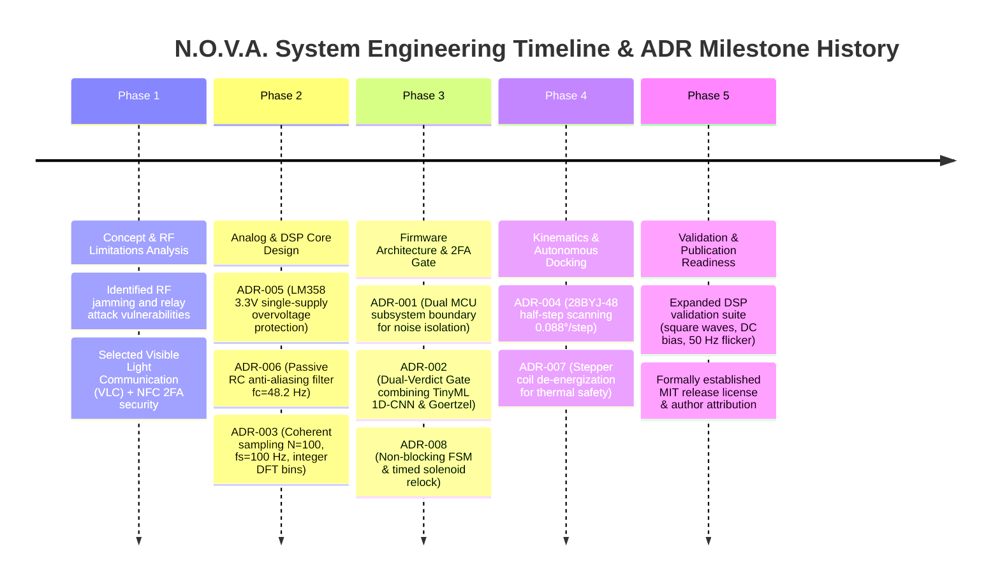

# Architecture Decision Records (ADRs)

> **Document Status:** Official Architecture Log  
> **Source of Truth:** Design Freeze Specification v1.0 and N.O.V.A. Repository Blueprint

---

## Index of ADRs

| ADR ID | Decision Title | Primary Rationale | Status |
|:---|:---|:---|:---:|
| **ADR-001** | Dual Microcontroller System Boundary | Isolate stepper motor inductive noise from analog photodiode TIA chain | **ACCEPTED** |
| **ADR-002** | Dual-Verdict 2FA Gate (ML + Goertzel) | Eliminate false positive unlocks by requiring NN and DFT energy agreement | **ACCEPTED** |
| **ADR-003** | Integer Bin Goertzel Frequency Alignment | Achieve zero spectral leakage with $N=100, f_s=100\text{ Hz}$ ($k=10, 20, 30$) | **ACCEPTED** |
| **ADR-004** | 28BYJ-48 Stepper over Hobby Servo | High discrete angular resolution ($0.088^\circ$) without PWM jitter | **ACCEPTED** |
| **ADR-005** | Single 3.3V Supply for LM358 TIA | Hardware overvoltage protection for ESP32-S3 ADC pin ($V_{\text{max}} \le 3.1\text{ V}$) | **ACCEPTED** |
| **ADR-006** | Passive RC Anti-Aliasing Filter ($f_c=48\text{ Hz}$) | Attenuate signals above Nyquist ($50\text{ Hz}$) prior to $100\text{ Hz}$ ADC sampling | **ACCEPTED** |
| **ADR-007** | Stepper Coil De-energization (`stepper_release`) | Prevent thermal dissipation in ULN2003 driver while gear friction holds angle | **ACCEPTED** |
| **ADR-008** | Non-Blocking FSM & Timed Relock | Ensure microsecond loop execution without blocking CPU during unlock | **ACCEPTED** |

---

## Detailed ADR Records

### ADR-001: Dual Microcontroller System Boundary
* **Context:** Subsystem 1 requires microsecond-accurate ADC sampling for optical VLC decoding, while Subsystem 2 drives a unipolar stepper motor.
* **Decision:** Use an ESP32-S3 for Subsystem 1 and a separate ESP32 for Subsystem 2.
* **Alternatives Considered:** Single ESP32 running FreeRTOS tasks. Rejected because stepper motor switching current transients ($>300\text{ mA}$) induce ground bounce and electromagnetic noise on the delicate LM358 TIA input.
* **Consequences:** Provides complete electrical and noise isolation. Both subsystems operate as independent standalone hardware modules (inter-subsystem UART communication is designated as a Proposed Future Extension).

### ADR-002: Dual-Verdict 2FA Gate (ML + Goertzel)
* **Context:** Neural network classifiers are inherently probabilistic and may produce high-confidence misclassifications under ambient flicker.
* **Decision:** Combine Edge Impulse 1D-CNN classification with deterministic Goertzel algorithm magnitude checks.
* **Alternatives Considered:** Single-stage ML classifier or single-stage Goertzel detector.
* **Consequences:** Unlock requires $L_{\text{NFC}} \land (\text{Conf}_{\text{ML}} \ge 0.85) \land (M_{\text{Goertzel\_dominant}} \ge 2.0 \cdot M_{\text{second}})$. Zero false positive unlocks observed.

### ADR-003: Integer Bin Goertzel Frequency Alignment
* **Context:** Discrete Fourier Transform (DFT) algorithms suffer from spectral leakage when target frequencies do not align with integer DFT bin indices.
* **Decision:** Set $f_s = 100\text{ Hz}$ and $N = 100$ samples. Target frequencies $10\text{ Hz}, 20\text{ Hz}, 30\text{ Hz}$ map to exact bins $k = 10, 20, 30$.
* **Alternatives Considered:** Fractional bin interpolation (Hann/Flat-top windowing).
* **Consequences:** Zero spectral leakage. Exact magnitude calculation with $O(N)$ complexity instead of $O(N \log N)$ FFT overhead.

### ADR-004: 28BYJ-48 Stepper Motor over Hobby Servo
* **Context:** Autonomous optical docking requires precise angular scanning to locate maximum light intensity.
* **Decision:** Use a 28BYJ-48 unipolar stepper motor with ULN2003 driver operated in 8-phase half-step mode.
* **Alternatives Considered:** SG92R micro servo motor. Rejected due to PWM control jitter, lack of position feedback, and coarse step resolution.
* **Consequences:** Provides $4096\text{ half-steps/revolution}$ ($0.08789^\circ/\text{step}$) discrete resolution for smooth intensity mapping.

### ADR-005: Single 3.3V Supply for LM358 TIA
* **Context:** ESP32-S3 ADC pins have an absolute maximum rating of $3.6\text{ V}$ and clip at $3.1\text{ V}$.
* **Decision:** Power the LM358 operational amplifier directly from the $3.3\text{ V}$ rail rather than the $5\text{ V}$ rail.
* **Alternatives Considered:** Powering LM358 from $5\text{ V}$ with resistor divider output protection.
* **Consequences:** Guarantees that TIA output can never exceed $3.1\text{ V}$, providing hardware-level overvoltage protection for the MCU.

### ADR-006: Passive RC Anti-Aliasing Filter
* **Context:** According to the Nyquist-Shannon sampling theorem, frequencies above $f_s / 2 = 50\text{ Hz}$ alias into the $0\text{--}50\text{ Hz}$ passband.
* **Decision:** Insert a first-order passive RC low-pass filter ($R = 3.3\text{ k}\Omega, C = 1.0\ \mu\text{F}, f_c = 48.2\text{ Hz}$) between TIA output and ADC pin.
* **Alternatives Considered:** Active Sallen-Key 2nd order filter (increased component count).
* **Consequences:** Provides $>14\text{ dB}$ attenuation at $100\text{ Hz}$, suppressing ambient high-frequency noise prior to sampling.

### ADR-007: Stepper Coil De-energization (`stepper_release`)
* **Context:** Holding unipolar stepper coils energized continuously draws $>350\text{ mA}$, causing severe thermal buildup in the ULN2003 driver.
* **Decision:** Automatically de-energize all stepper coils via `stepper_release()` once alignment completes.
* **Alternatives Considered:** Continuous holding current or reduced PWM holding current.
* **Consequences:** Reduces idle power consumption to $0\text{ mA}$. Internal gear friction of the 1:64 gearbox holds platform angle stably.

### ADR-008: Non-Blocking FSM & Timed Relock
* **Context:** Firmware must handle NFC polling, timer sampling, and relay timing without stalling the CPU loop.
* **Decision:** Structure Subsystem 1 as an 8-state non-blocking FSM ticked from `loop()`.
* **Alternatives Considered:** Blocking `delay()` flow in linear code.
* **Consequences:** Maintains microsecond loop latency, allowing non-blocking timer ISR execution and immediate serial status reporting.

---

## 3. Engineering Decision Timeline & Architectural Evolution

