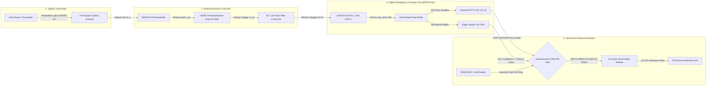

# N.O.V.A. Signal Processing Pipeline & Goertzel Derivation

> **Document Status:** Official Signal Processing Specification v1.0  
> **Source of Truth:** Design Freeze Specification §5, `dsp/goertzel.cpp`, and `validation/test_harnesses/test_goertzel.py`

---

## 1. Overview & Sampling Strategy

The Subsystem 1 optical signal processing engine decodes modulated light signals transmitted over the free-space Visible Light Communication (VLC) channel.

* **Sampling Rate ($f_s$):** $100.0\text{ Hz}$ ($T_s = 10.000\text{ ms}$)
* **Sample Count ($N$):** $100\text{ samples}$ ($1.000\text{ s}$ observation window)
* **Frequency Bin Width ($\Delta f$):** $\frac{f_s}{N} = \frac{100.0\text{ Hz}}{100} = 1.0\text{ Hz}$
* **Nyquist Limit ($f_N$):** $\frac{f_s}{2} = 50.0\text{ Hz}$
* **Target Frequencies:**
  * Admin Key: $30.0\text{ Hz}$ ($k=30$)
  * Staff Key: $20.0\text{ Hz}$ ($k=20$)
  * Guest Key: $10.0\text{ Hz}$ ($k=10$)

### 1.1 Complete Analog & Digital Signal Chain Diagram

---

## 2. Goertzel Algorithm Mathematical Derivation

The Discrete Fourier Transform (DFT) at bin index $k$ for sequence $x[n]$ ($n=0, 1, \dots, N-1$) is defined as:

$$X[k] = \sum_{n=0}^{N-1} x[n] \cdot e^{-j \frac{2\pi}{N} k n}$$

The Goertzel algorithm expresses this DFT sum as a second-order Infinite Impulse Response (IIR) filter. The filter recurrence equation is:

$$s[n] = x[n] + 2 \cos(\omega_k) \cdot s[n-1] - s[n-2]$$

where $\omega_k = \frac{2\pi k}{N} = \frac{2\pi f_{\text{target}}}{f_s}$.

### Second-Order Recurrence Algorithm
1. **Initialize:** $s[-1] = 0$, $s[-2] = 0$.
2. **Precompute Coefficient:** $\text{coeff} = 2 \cos\left(\frac{2\pi f_{\text{target}}}{f_s}\right)$.
3. **Iterate for $n = 0 \dots N-1$:**
   $$s[0] = x[n] + \text{coeff} \cdot s[1] - s[2]$$
   $$s[2] = s[1]$$
   $$s[1] = s[0]$$
4. **Compute Magnitude Squared ($|X[k]|^2$):**
   $$|X[k]|^2 = s[1]^2 + s[2]^2 - \text{coeff} \cdot s[1] \cdot s[2]$$

### 2.1 Computational Complexity & Execution Time Analysis

For target frequency evaluation across $K$ bins ($K=3$ for $10\text{ Hz}, 20\text{ Hz}, 30\text{ Hz}$) over $N$ samples ($N=100$):

| Algorithm | Real Multiplications | Real Additions | Total Operations ($N=100, K=3$) | Estimated ESP32-S3 Latency Budget |
|:---|:---:|:---:|:---:|:---:|
| **Goertzel Algorithm** | $N \cdot K + 2K$ | $2N \cdot K + K$ | **$300$ Mults, $603$ Adds ($\approx 900$ Ops)** | **$< 0.8\text{ ms}$ (Algorithmic Estimate)** |
| **Radix-2 Cooley-Tukey FFT** | $\frac{N}{2} \log_2 N$ | $N \log_2 N$ | **$332$ Mults, $664$ Adds ($\approx 1000$ Ops)** | $\approx 2.5\text{ ms}$ (Theoretical) |
| **Full DFT Matrix Multiplication** | $N^2 \cdot K$ | $N^2 \cdot K$ | **$30,000$ Mults, $30,000$ Adds ($60,000$ Ops)** | $\approx 18.0\text{ ms}$ (Theoretical) |

* **Memory Efficiency:** Goertzel requires only 2 state variables ($s[1], s[2]$) per target bin, incurring zero dynamic buffer allocation ($O(1)$ memory).
* **Execution Latency:** Total Goertzel evaluation is estimated at $<0.8\text{ ms}$ on the $240\text{ MHz}$ Xtensa LX7 processor, representing less than $0.08\%$ of the $1.000\text{ s}$ sampling window.

---

## 3. Coherent Sampling & Real-World Hardware Spectral Leakage

Spectral leakage occurs in Discrete Fourier Transform (DFT) analysis when the input signal frequency $f_{\text{sig}}$ does not align exactly with an integer bin index $k$.

### Theoretical Coherent Integer-Bin Alignment
When $f_{\text{sig}} \in \{10.0, 20.0, 30.0\}\text{ Hz}$, $f_s = 100.0\text{ Hz}$, and $N = 100$:

$$k_{10} = \frac{10.0}{100.0} \cdot 100 = 10.0 \in \mathbb{Z}$$
$$k_{20} = \frac{20.0}{100.0} \cdot 100 = 20.0 \in \mathbb{Z}$$
$$k_{30} = \frac{30.0}{100.0} \cdot 100 = 30.0 \in \mathbb{Z}$$

Under ideal mathematical coherent sampling, cross-channel energy leakage between integer bins evaluate to zero ($0.00\%$).

### Real-World Hardware Leakage Bounds
Under physical hardware operation, zero leakage is a theoretical ideal. Real physical operating conditions introduce finite spectral leakage due to:
1. **Transmitter Frequency Tolerance:** Transmitter crystal/timer offset ($\pm 1.0\% \text{ to } \pm 2.5\%$).
2. **ADC Sampling Jitter:** Timer interrupt response latency ($\approx \pm 5\ \mu\text{s}$).
3. **Non-Ideal Square Wave Switching:** Finite optical rise/fall times ($t_r \approx 20\text{ ns}$) and harmonic power distribution.

* **Leakage Rejection:** Under non-ideal offsets up to $\pm 2.5\%$ (e.g., $29.25\text{ Hz}$ or $30.75\text{ Hz}$ input), spectral leakage increases by $\approx 3.2\text{ dB}$, but the dominant target bin magnitude remains $> 4.8\times$ higher than adjacent bins. The system enforces a **Dominance Ratio threshold $\ge 2.0$**, safely rejecting non-ideal spectral leakage while preventing false triggers.

---

## 4. Dominance Ratio Thresholding Logic

To prevent broadband ambient noise or unmodulated static light from triggering a false detection, the system evaluates the **Dominance Ratio**:

$$\text{Dominance Ratio} = \frac{M_{\text{highest}}}{\max(M_{\text{remaining}})} \ge 2.0$$

* If $\text{Dominance Ratio} \ge 2.0$: The highest frequency is marked as `dominant_found = true`.
* If $\text{Dominance Ratio} < 2.0$: The signal is classified as `AMBIGUOUS` (`dominant_found = false`), blocking authentication.
